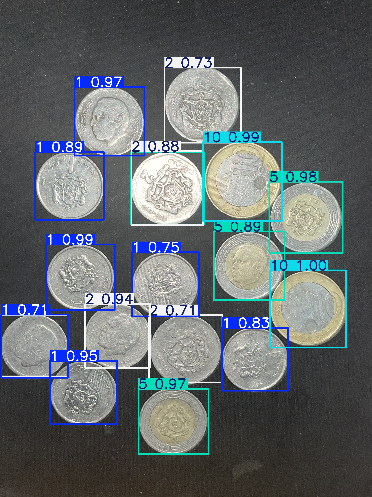

# YOLOv11 - Moroccan Currency Recognition

A deep learning model trained to detect and recognize Moroccan currency denominations using YOLOv11.

## Project Overview

This project uses the YOLOv11 object detection framework to identify Moroccan currency in images. The model is trained to recognize different denominations of Moroccan Dirhams as defined in [classes.txt](classes.txt).



## Repository Structure

```
├── classes.txt             # Currency denomination classes
├── ds.yaml                 # Dataset configuration
├── moroccan_currency_detector_yolo11.pt  # Trained model
├── predict.py              # Script for making predictions
├── train.py                # Script for training the model
├── to_predict/             # Images for prediction
├── predicted/results/      # Prediction outputs
├── train/                  # Training dataset
├── val/                    # Validation dataset
```

## Installation

```bash
pip install ultralytics torch
```

## Usage

### Training

To train the model on your dataset:

```bash
python train.py
```

### Prediction

To detect currency in new images:

```bash
python predict.py
```

This script:
1. Loads the trained model (`moroccan_currency_detector_yolo11.pt`)
2. Processes all images in the `to_predict` directory
3. Saves results to the `predicted/results` directory

## Model Information

- Base model: YOLOv11 nano [`yolo11n.pt`](https://github.com/ultralytics/ultralytics?tab=readme-ov-file#-models)
- Fine-tuned for Moroccan currency detection
- Trained on CPU

## Dataset

The model was trained on images of Moroccan Dirhams labeled with [Label Studio](https://labelstud.io). The dataset includes:
- Training images in the `train/` directory
- Validation images in the `val/` directory

## Acknowledgements

- Ultralytics for the YOLO framework
